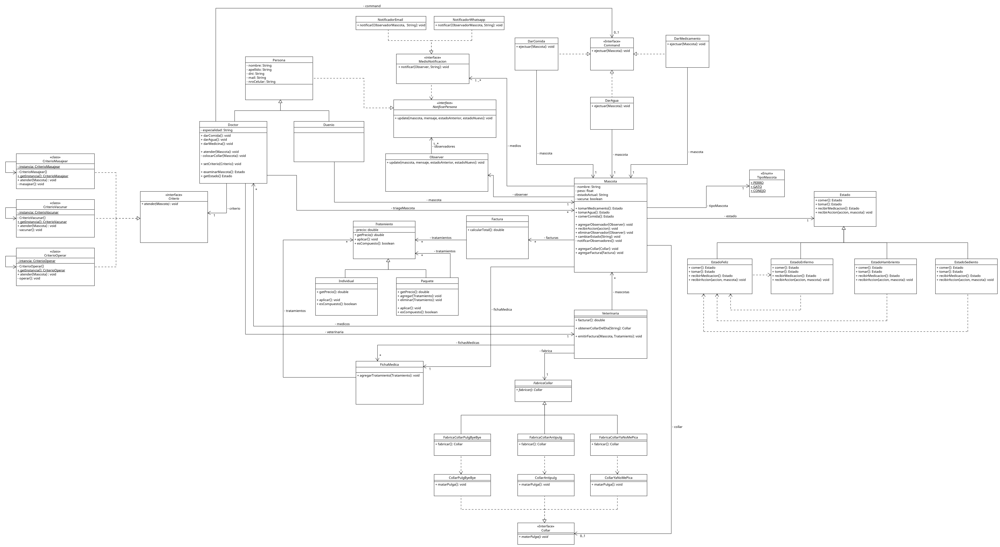
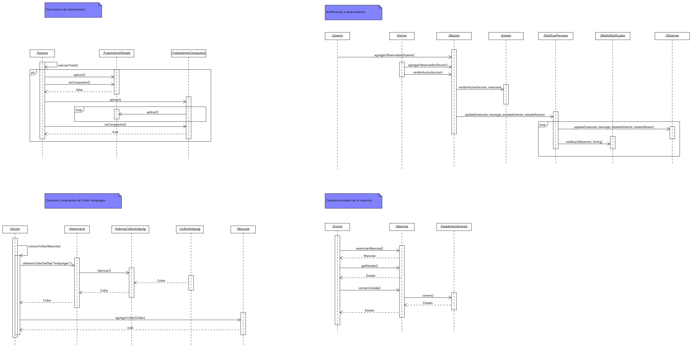

# 🐾 Sistema de Gestión Veterinaria "Cuidamos tu Mascota"

> Trabajo Práctico de Diseño Orientado a Objetos - Programación II (2025)

## 📖 Descripción del Proyecto
Este proyecto consiste en el diseño y desarrollo de un sistema de gestión integral para una clínica veterinaria. El objetivo principal es administrar la internación de mascotas, sus tratamientos médicos, la facturación y el seguimiento en tiempo real de su estado de salud.

La arquitectura del software se centra en la **flexibilidad y escalabilidad**, utilizando **Patrones de Diseño** para desacoplar la lógica de negocio y permitir la extensión del sistema sin modificar el código base.

## 🚀 Desafío Técnico
El sistema debía resolver problemáticas complejas de diseño, tales como:
* Comportamientos dinámicos de las mascotas según su estado de ánimo/salud.
* Múltiples criterios médicos configurables en tiempo real.
* Notificaciones asincrónicas a dueños y doctores.
* Facturación unificada de servicios individuales y paquetes compuestos.

## 🛠️ Arquitectura y Patrones de Diseño Aplicados
Para resolver los requerimientos, se implementaron los siguientes patrones:

### 1. Behavior: State
**Problema:** El comportamiento de la mascota ante acciones (comer, beber) varía según su estado (Feliz, Enfermo, Hambriento).
**Solución:** Se implementó el patrón **State** para encapsular cada estado en una clase propia, permitiendo que la mascota transicione dinámicamente y cambie su respuesta sin usar condicionales complejos.

### 2. Creational: Factory Method
**Problema:** La clínica utiliza distintas marcas de collares antipulgas y el doctor debe asignar el disponible en el día sin conocer la marca específica.
**Solución:** Se utilizó **Factory Method** para desacoplar la creación del collar. El Doctor interactúa con la interfaz `Collar`, mientras que las fábricas concretas se encargan de instanciar la marca correspondiente (`Antipulg`, `PulgByeBye`, etc.).

### 3. Structural: Composite
**Problema:** Necesidad de facturar y aplicar tanto tratamientos simples como "paquetes" médicos de forma uniforme.
**Solución:** Mediante el patrón **Composite**, se trataron los servicios individuales y los paquetes de tratamientos bajo una misma estructura de árbol, simplificando el cálculo de costos en la facturación.

### 4. Behavior: Observer
**Problema:** Notificar en tiempo real a dueños y doctores sobre cambios en la salud de la mascota.
**Solución:** Se aplicó **Observer** para que la `Mascota` notifique automáticamente a sus suscriptores (Dueños/Doctores) ante cualquier cambio de estado, utilizando diferentes estrategias de envío (WhatsApp, Email).

### 5. Behavior: Command
**Problema:** Encapsular las acciones médicas (Dar Comida, Dar Medicina) para que sean intercambiables.
**Solución:** El patrón **Command** permitió modelar cada acción como un objeto independiente, facilitando la ejecución diferida o parametrizada por parte del Doctor.

### 6. Behavior & Creational: Strategy + Singleton
**Problema:** Unificar los criterios de atención médica (Operar, Vacunar) asegurando que sean únicos en el sistema.
**Solución:** Se usó **Strategy** para intercambiar la forma de atender en tiempo de ejecución y **Singleton** para garantizar una única instancia de cada criterio compartida por todos los doctores.

## 📊 Diagramas UML
*(Puedes ver los diagramas completos en el repositorio)*

### Diagrama de Clases

### Ejemplo de Secuencia: Asignación de Collar (Factory Method)

## 📝 Enunciado: Clínica Veterinaria "Cuidamos tu Mascota"

Una afamada clínica veterinaria de la Ciudad de Buenos Aires, “Cuidamos tu mascota”, solicita el desarrollo de una aplicación para gestionar las mascotas (Perros, Gatos y Conejos) que quedan internadas en su institución.

**Gestión de Ingreso e Historial**
Al ingresar a la clínica se verifica si la mascota cuenta o no con ficha médica. Si no posee, debe crearse una y asignarla. En la misma se incluirá todo el historial clínico. El dueño de la mascota podrá pedir en cualquier momento el mismo (el historial es parte de la ficha y tiene todos los registros de visita y los tratamientos que tuvo la mascota).

**Atención y Estado de las Mascotas**
Antes de ingresar a la clínica, las mascotas son examinadas por un doctor (del cual se sabe nombre, apellido, DNI, email, número de celular y una especialidad que se corresponde al tipo de animal que manejan). El doctor realiza una observación de cada mascota, identificando su nombre, peso, si tiene o no una vacuna y su **estado**, que puede ser: *Feliz, Enfermo, Hambriento o Sediento*.

Dependiendo de cómo esté cada mascota, ella responderá de manera distinta ante las acciones que puede realizar el doctor (*Dar de comer, Dar de tomar, Dar Medicina*):

* Si la mascota está **hambrienta** y le dan de comer, se pone **feliz**. De la misma manera si está **sedienta** y le dan de tomar, o si está **enferma** y le dan medicina.
* Si le dan de comer y está **feliz**, de tanta comida se va a poner **enferma**.
* Si las acciones son distintas a las enunciadas, el comportamiento no es importante (puede hacer un ruido, vomitar, etc.), pero el estado seguirá siendo el mismo.

La aplicación permitirá a los dueños (se sabe de ellos nombre, apellido, DNI, email y número de celular) enterarse del estado de todas sus mascotas en **tiempo real**. Por ejemplo, si una mascota ingresa enferma y deja de estarlo, el dueño debería recibir una notificación en su correo electrónico.
Por otro lado, los Doctores pueden decidir a qué mascotas hacerle seguimiento continuo, de tal manera que también pueden recibir estas notificaciones aunque no se encuentren de guardia en la clínica.

Los Doctores tienen distinto criterio a la hora de atender (*Realizar una operación, Inyectar medicina, Hacer masajes*) a las mascotas, que pueden variar dependiendo de los síntomas que presente. El sistema debe soportar que el doctor cambie dicha manera en que atiende las mascotas a demanda. Dichos criterios deben ser **únicos y compartidos** por todos los Doctores de la veterinaria.

Al momento de facturar los servicios realizados, la veterinaria deberá poder ofrecer tanto **tratamientos individuales** como **conjuntos de tratamientos** que incluyan varios procedimientos a realizar por cada Doctor. Por ejemplo: *"Vacunar"* como tratamiento individual, o *"Tiene un año"* (un paquete que incluye todos los tratamientos a aplicarle a una mascota al cumplir un año, como vacunarlo, hacerle masajes, etc.).

Por último, a las mascotas atendidas en la veterinaria se les coloca un collar antipulgas, que puede ser de distintas marcas (*”Antipulg”, “PulgByeBye” o “YaNo Mepica”*). El Doctor debe colocarles el collar que la veterinaria esté usando ese día **sin que le importe de qué marca es**.

## 👥 Integrantes del Equipo
* **Artecona, Lautaro**
* **Imizcoz, Lucas**
* **Lorentti, Lautaro**
* **Maggiaiuolo, Máximo**
* **Nuñez, Valentin**

---
*ORT - Programación II - 2025*
